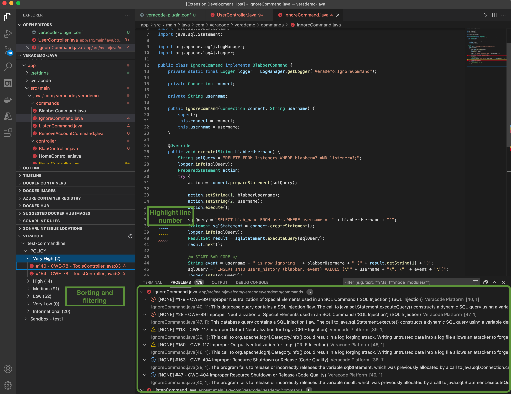
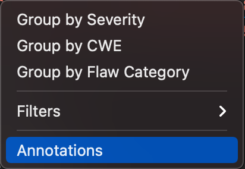
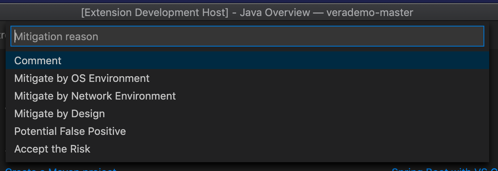
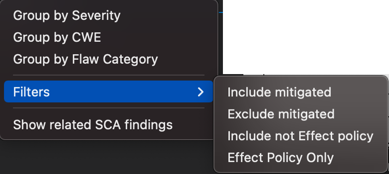
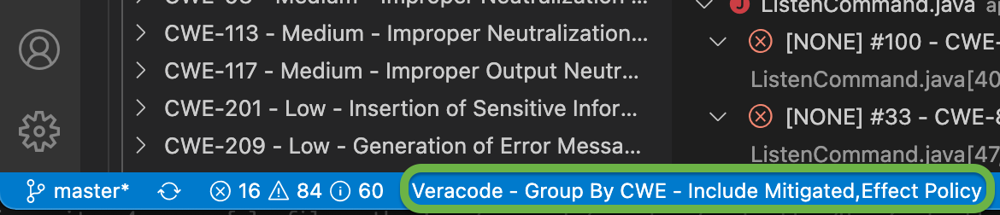
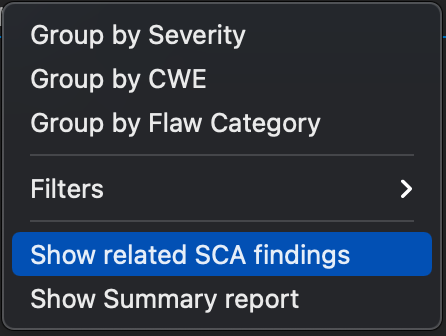
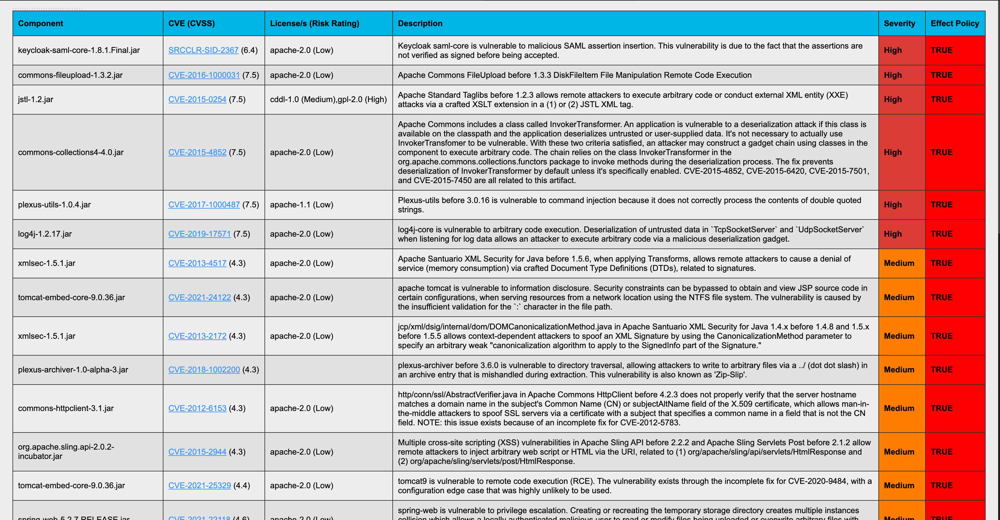
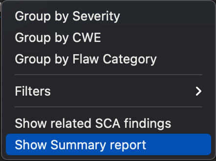
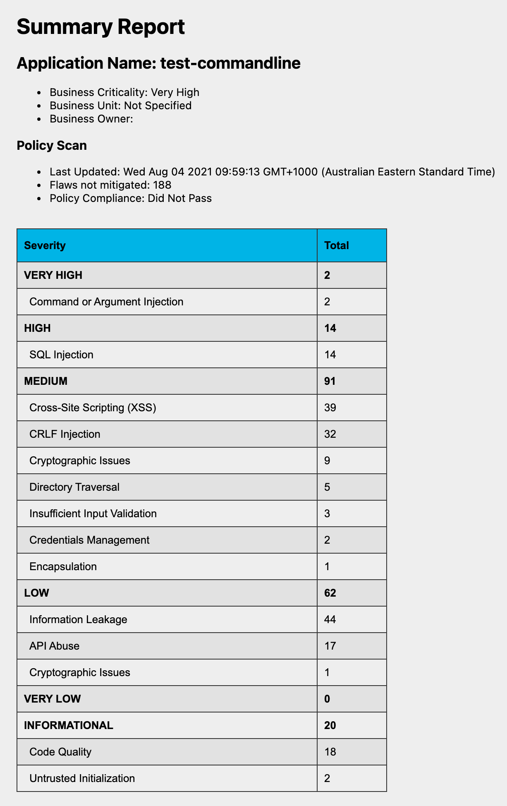

[](https://sonarcloud.io/dashboard?id=Lerer_VSCode-Veracode-Unified)  [](http://www.github.com/lerer) [](https://github.com/Lerer/VSCode-Veracode-Unified/issues?q=is%3Aopen+is%3Aissue+label%3Aenhancement) [](https://github.com/Lerer/VSCode-Veracode-Unified/issues?q=is%3Aopen+is%3Aissue+label%3Abug)

# About

This is a VSCode plugin which integrate with the Veracode platform and enables downloading of scan results (findings).

The plugin does not support upload for scan action. 

<p align=center>

</p>

# Plugin Configuration

This extension contributes the following settings (default values are shown in parenthesis):

* `veracode.credsFile`: (<your_home_directory>/.veracode/credentials)
  * a text file of the format 
  ```
  [default]
  veracode_api_key_id = <your_veracode_api_id>
  veracode_api_key_secret = <your_veracode_api_key>
  ```
* `veracode.API profile in configuration file`: The profile (or section) of API credentials to be used for communicating with Veracode Platform. (showing `default` in the above example).
* `veracode.scanCount`: (10) Number of scans to show for each app.  Scans will be shown from newest to oldest.
* `veracode.sandboxCount`: (5) Number of sandboxes to show for each app
* `veracode.logLevel`: (info) Logging level that shows in the Debug Console.  Will require a restart for changes to take effect.
* `veracode.proxyHost`: (none) Proxy host name (e.g., https://my-proxy.com)
* `veracode.proxyPort`: (none) Port on the proxy host (e.g., 8080)
* `veracode.proxyName`: (none) Username if the proxy host requires a login 
* `veracode.proxyPassword`: (none) Password if the proxy host requires a login

# Workspace Configuration
One of the latest features enable bringing in only a single application and specific sandbox to the current workspace.  
To enable this, please add the a file name `veracode-plugin.conf` to the project root directory. The file content should be as follow:
```
[import]
# Application name filtering
application=Teast CSharp
# Sandbox filtering
sandbox=__policy
```
The configuration allow to filter with exact name (application and/or sandbox).  
To get only the scans in the main policy (not in sandbox), set: `sandbox=__policy` 

# Flaw mitigations and comments  
User can propose mitigations for none mitigated flaws and comments to all flaws. The annotations assosiated with the annotations will be saved to the cloud platform. 

<p align=center>

</p>

<p align=center>

</p>

# Sorting and Filtering
The menu (from the Veracode tree explorer pane) have few sorting and filtering options.

<p align=center>

</p>

## Sorting and Grouping
- __Sort by Severity__: will organize flaws by their severity
  - Medium
    - #6 - CWE-80 - \<File_Name\>:\<line number\>
- __Sort by CWE__: will organize the findings by CWE with a title:
  - CWE-80 - Medium - Improper Neutralization of Script-Related HTML Tags in a Web Page (Basic XSS)
    - #4 - \<File_Name\>:\<line number\>
- __Sort by Flaw Category__: will organize and group findings by the flaw Category
  - \<Flaw Category Name\>
    - #5 - \<Severity\> - CWE-XXX - \<File_Name\>:\<line number\>

## Filtering
- __Mitigations__ : will allow to include or exclude mitigated findings
- __Effecting Policy__ : Will enable to remove findings which are not effecting policy associate with the Application Profile 

__Note:__ The selected grouping and the filtering you can view at the IDE status bar
<p align=center>

</p>

# Reports
Few new options for reporting from the Sandbox/Policy level

## Software Composition Analysis (SCA)
Get a view of the vulnerabilities associate with the application policy or sandbox scan

The import menu option is available at the POLICY/sandbox level
<p align=center>

</p>
Clicking on the option will open (with a delay of few seconds) a new page (web view) in the IDE of the SCA findings
<p align=center>

</p>

## Summary Report
Fetch the summary report of the Policy/Sandbox.  
__Note__ - results includes also mitigated findings

<p align=center>

</p>

<p align=center>

</p>


          
## Found a problem? Want to request a feature?
Please log an issue.  

# A note about the author
While it's true that I work at [Veracode](https://www.veracode.com/) at the time of writing this plugin - this is not an official supported plugin by Veracode.

# Credit
The initial code base of this plugin was created by a colleague of mine - [Kevin Rise](https://gitlab.com/buzzcode).


